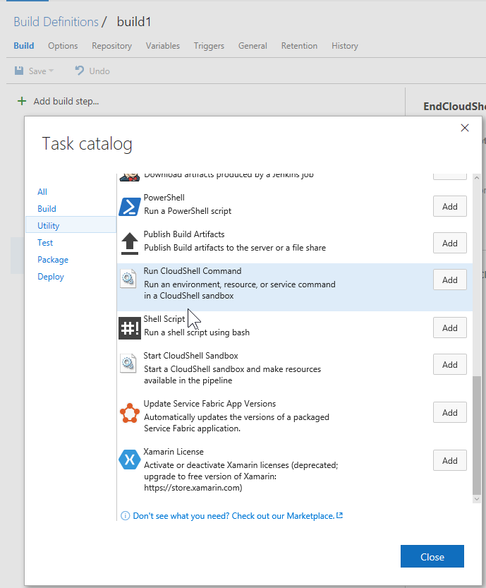
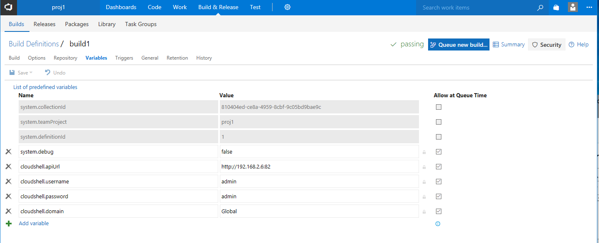
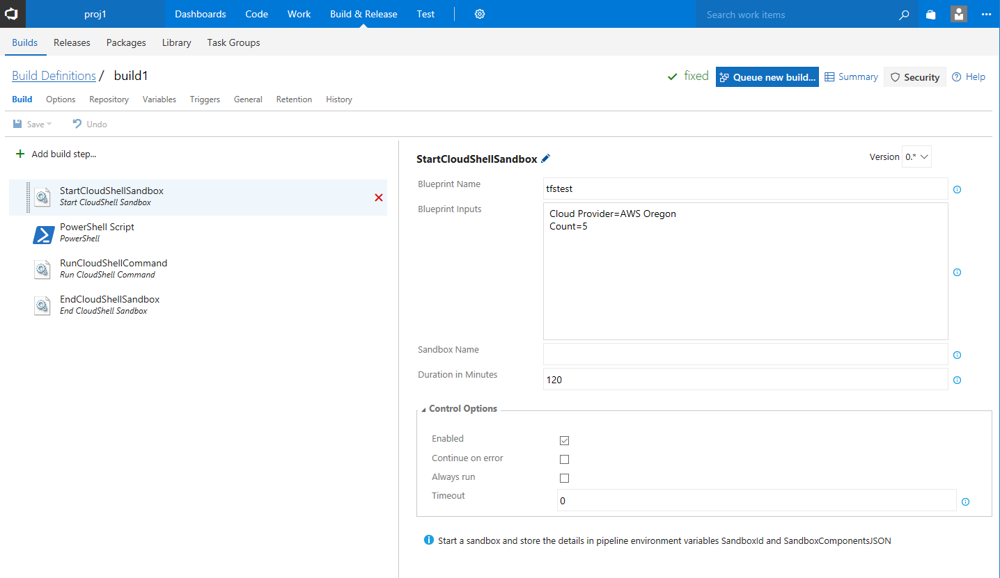
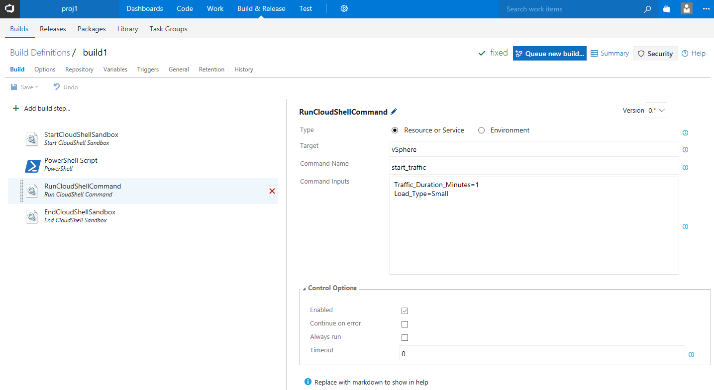
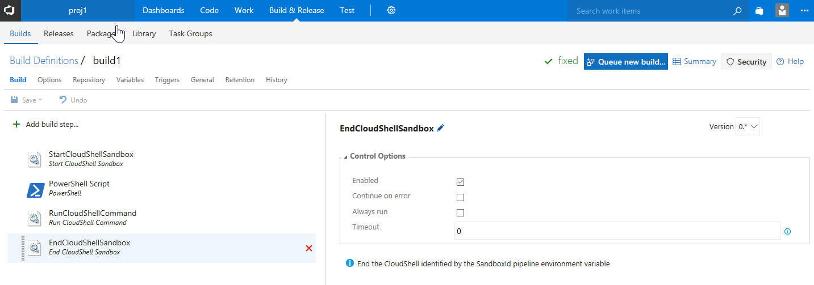
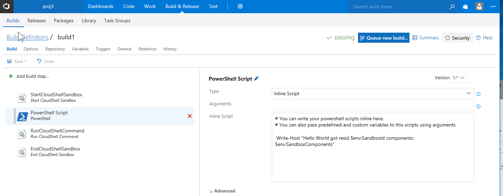
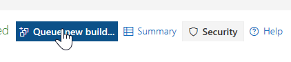
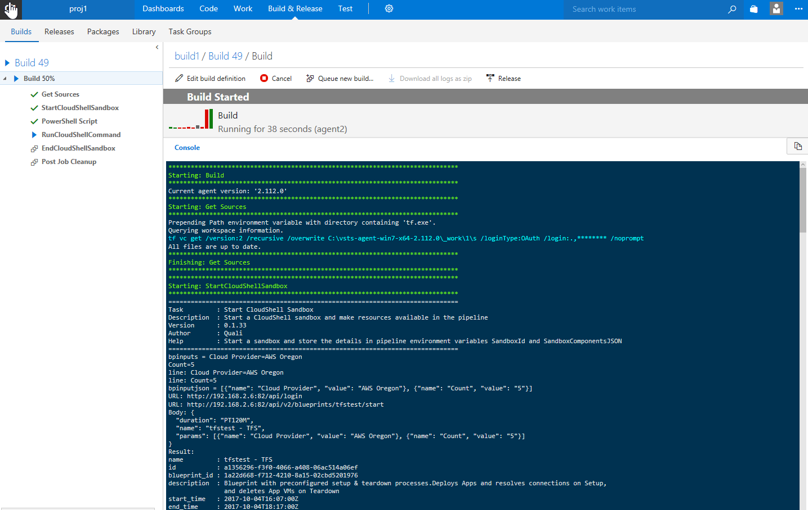

# TFS-Plugin

## Overview

CloudShell custom tasks for TFS build or release workflows.

- StartCloudShellSandbox
	- Start a sandbox from a blueprint name, supporting topology inputs
	- Stores environment variables for the sandbox id and JSON describing the services and resources
- EndCloudShellSandbox
	- End the sandbox using the sandbox id in the environment
- RunCloudShellCommand
	- Run an environment or service/resource command
	- With inputs
	- Target resource or service can be specified with a regex in case of a deployed app with a randomized name

	
CloudShell credentials must be set as build or release variables in the build or release `Variables` tab in TFS:

- cloudshell.apiUrl
- cloudshell.username
- cloudshell.password
- cloudshell.domain

TODO: Make cloudshell.password a secret variable, which must be accessed from the code differently: https://stackoverflow.com/questions/35294742/how-do-i-use-secret-variables-in-tfs-2015-vnext-build-definitions 

## Usage

Add CloudShell tasks to a TFS build or release workflow:

Set CloudShell connection info in workflow variables:

Start a CloudShell sandbox and wait for Setup:

Run a CloudShell command (environment, resource, or service):

Tear down a CloudShell sandbox:

Access CloudShell reservation id and JSON resource and service details from a third-party TFS task:

Executing the workflow:

## Test data

Zip the contents of `test_environment` and drag into the portal.

*!!! Be sure the blueprint is marked public !!!*

## Development and Installation

For each of the tasks, you must download the VstsTaskSdk library to bundle it in the task packages:

    Save-Module -Name VstsTaskSdk -Path .\

Under each task, create a `ps_module` folder and copy `VstsTaskSdk` *excluding the folder like 0.10.0* so that these paths exist:

- `StartCloudShellSandbox\ps_module\VstsTaskSdk\`
- `EndCloudShellSandbox\ps_module\VstsTaskSdk\`
- `RunCloudShellCommand\ps_module\VstsTaskSdk\`

In `VstsTaskSdk` you should see multiple files including `VstsTaskSdk.psd1`.

In PowerShell, install `tfx` command line tool:

	npm install -g tfx-cli
	
In the TFS 2017 GUI, generate an access token.

In PowerShell:

	tfx login
	URL: http://my_tfs_server:8080/tfs/DefaultCollection
	Token: the access token

Package each task and upload it:

    tfx build tasks upload --task.path .\StartCloudShellSandbox\
    tfx build tasks upload --task.path .\EndCloudShellSandbox\
    tfx build tasks upload --task.path .\RunCloudShellCommand\

You must manually increment the patch number in each task.json every time you upload.

