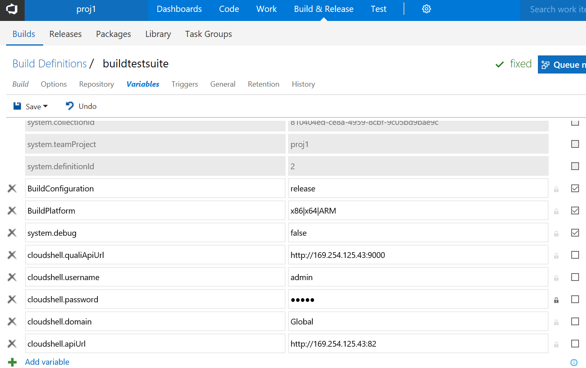

# TFS-Plugin

## Overview

CloudShell custom tasks for TFS build or release workflows.

- StartCloudShellSandbox
	- Start a sandbox from a blueprint name
	- Supports topology inputs
	- Stores environment variables available to other tasks in this workflow run
		- SandboxId
		- SandboxComponents: raw JSON from the sandbox API describing the services and resources:
			- name
			- address
			- attributes
- EndCloudShellSandbox
	- End the sandbox using the sandbox id env var set earlier by a StartCloudShellSandbox step
- RunCloudShellCommand
	- Run an environment or service/resource command
	- With inputs
	- Uses the sandbox id env var set earlier by a StartCloudShellSandbox step
	- Target resource or service can be specified with a regex in case of a deployed app with a randomized name
- RunCloudShellTestSuite
	- Run an existing test suite
	- With test inputs (not yet implemented)
	- With a blueprint for each job (not yet implemented)

	
CloudShell credentials must be set as build or release variables in the build or release `Variables` tab in TFS:

- `cloudshell.apiUrl` e.g. http://localhost:82
- `cloudshell.qualiApiUrl` e.g. http://localhost:9000
- `cloudshell.username` e.g. admin
- `cloudshell.password` e.g. admin
- `cloudshell.domain` e.g. Global

Click the lock button to make `cloudshell.password` private.

## Usage

Add CloudShell tasks to a TFS build or release workflow:

Set CloudShell connection info in workflow variables:

Task to start a CloudShell sandbox and wait for Setup:

Task to run a CloudShell command (environment, resource, or service):

Task to tear down a CloudShell sandbox:

Accessing CloudShell reservation id and JSON sandbox details from any third-party TFS task:

Task to run a CloudShell test suite:

Executing the workflow:

TFS:

VSTS:

## Test data

Zip the contents of `test_environment` and drag into the portal.

*!!! Be sure the blueprint is marked public !!!*

## Development and Installation

### System requirements

Tested on Windows 2016 with TFS 2017.1. Both are available as free trials.

TFS 2015 may have an incompatible package format and may not support the `tfx` CLI at all. 

### Downloading separately licensed Microsoft component

Download the VstsTaskSdk library that must be bundled into each task package:

    Save-Module -Name VstsTaskSdk -Path .\

This will download to the current directory.

Under the folder `ps_module` under each task folder, copy `VstsTaskSdk`, *removing the folder like `0.10.0` from the hierarchy*, so that these paths exist:

- `StartCloudShellSandbox\ps_module\VstsTaskSdk\`
- `EndCloudShellSandbox\ps_module\VstsTaskSdk\`
- `RunCloudShellCommand\ps_module\VstsTaskSdk\`
- `RunCloudShellTestSuite\ps_module\VstsTaskSdk\`

- `CloudShellVSTSExtension\startsandboxtask\ps_module\VstsTaskSdk\`
- `CloudShellVSTSExtension\endsandboxtask\ps_module\VstsTaskSdk\`
- `CloudShellVSTSExtension\runcommandtask\ps_module\VstsTaskSdk\`
- `CloudShellVSTSExtension\runsuitetask\ps_module\VstsTaskSdk\`

In `VstsTaskSdk` you should see multiple files including `VstsTaskSdk.psd1`.

### Installing the tasks to TFS

#### Prerequisite: Get `tfx` CLI

In PowerShell:

	npm install -g tfx-cli

Windows 2016 or TFS 2017 comes with `npm`.
	
##### TFS Installation

###### Install a Windows agent

On the machine where you want to install the agent (probably the TFS server itself):
- Go to http://my_tfs_server:8080/tfs/DefaultCollection/_admin/_AgentPool
- Click `Download Agent`
- Disregard the detailed instructions &mdash; all they do is unzip and show how to run if you don't want to run it as a service
- Unzip the zip file in some new directory under `c:\`. Note that if you extract it under your home directory, it will fail to start because of permissions errors.
- In PowerShell, run `.\configure.cmd` in the unzipped directory
- Answer `Y` when asked if you want to run as a service
- After a few minutes, refresh the page above and the agent should show as online
- In the event of failure, check for logs under the directory where you unzipped

###### Get an access token for the CLI

In the TFS 2017 GUI, generate a "personal access token" (PAT): https://roadtoalm.com/2015/07/22/using-personal-access-tokens-to-access-visual-studio-online/

###### Upload using the CLI

In PowerShell:

	tfx login
	URL: http://my_tfs_server:8080/tfs/DefaultCollection
	Token: the access token

Note that the URL must end with DefaultCollection.

Package each task and upload it:

    tfx build tasks upload --task.path .\StartCloudShellSandbox\
    tfx build tasks upload --task.path .\EndCloudShellSandbox\
    tfx build tasks upload --task.path .\RunCloudShellCommand\
    tfx build tasks upload --task.path .\RunCloudShellTestSuite\

Note: You must manually increment the patch number in `task.json` anytime you update a task.

##### VSTS Installation

###### Build `.vsix` file

The `.vsix` file must be tailored to your VSTS user.

Edit `CloudShellVSTSExtension\vss-extension.json` and set:

    "publisher": "ericrqs",

with your VSTS account name. This must be the VSTS account you use to upload the extension.

Build the extension from PowerShell:

	cd CloudShellVSTSExtension
	tfx extension create --manifest-globs .\vss-extension.json

*Upload* the .vsix package to a VSTS account:

*Share* the .vsix package with the accounts where you will run the extension:

Note: If you will publish and run with the same account, you still have to share it with yourself.

*Install* the package that you have shared under the account where you will run the pipeline:

